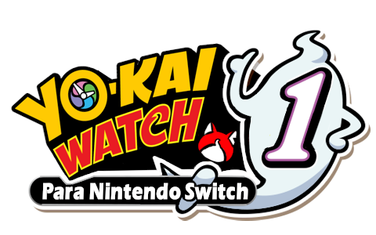
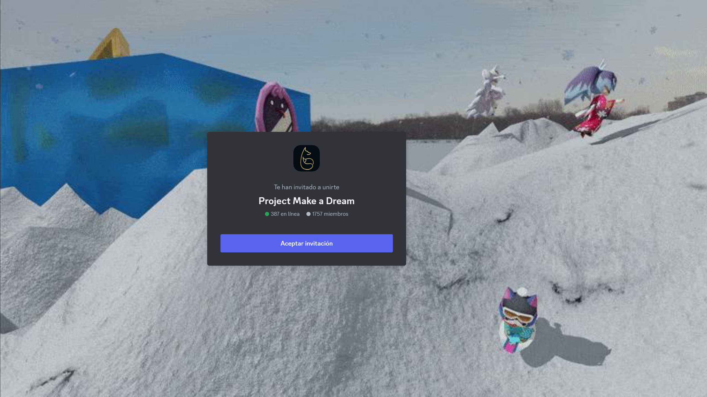

    
    
    

# Yo-Kai Watch 1 Switch Traduccion al español
Juego siendo traducido de manera manual desde la versión traducida al ingles.
# Importante
**Es necesaria la actualización 1.3.0 del juego para que todo funcione sin errores.**
# Instalación
Descarga la última versión desde [***releases***](https://github.com/yokaikomami07/YKW1SWITCH-ES/releases)

### Ryujinx:
En el directorio de datos de Ryujinx:
 - `/home/{USERNAME}/.config/Ryujinx/` en **Linux**.
 - `C:\users\{USERNAME}\AppData\Roaming\Ryujinx` en **Windows**.

Lo más probable es que la carpeta donde se necesiten poner los datos sea en `{...Ryujinx}/mods/contents/0100c0000ceea000/`

### Switch
Para atmosphere: `Atmosphere/contents/0100c0000ceea000`

Para SXOS: `SXOS/titles/0100c0000ceea000`

# Creditos
- Yo-kai Watch 1 Switch English Translation Mod Team (check [gbatemp.net page](https://gbatemp.net/threads/wip-yo-kai-watch-1-switch-english-translation-project.577591/)) - Base del juego en inglés.

# PROJECT MAKE A DREAM
Make a Dream es un servidor de discord en el que están varias de las traducciones de los juegos de Yo-kai watch al español, mangas, y fan-games hechos por la comunidad.
Cualquier duda en el servidor, siempre contestamos.

> [Discord](https://discord.gg/project-make-a-dream-846980324034347008)

